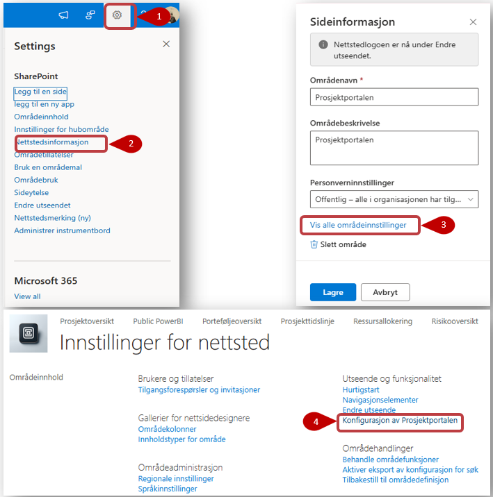

# Standardinnhold og endring av standardinnhold
Standarddokumenter, standardinteressenter, standardoppgaver og standard fasesjekkpunkter vedlikeholdes på porteføljenivå, og kan enkelt endres av en administrator eller bruker med riktig tilgang. Når Prosjektportalen installeres, fylles flere av disse listene med standardinnhold fra Prosjektveiviseren.

Innhold fra listene og biblioteket vil kunne kopieres inn i alle nye prosjekter som blir opprettet i denne porteføljen (dette er valg som kan gjøres ved opprettelse av et nytt prosjekt).

Innhold vedlikeholdes i *Konfigurasjon av Prosjektportalen*. Det er 2 alternativer for å komme inn på dette.
- **Alternativ 1** I footer av siden
  
 
  
- **Alternativ 2** Trykk på:
 1. **Tannhjulen** 
 2. **Nettstedsinformasjon (2)**.
 3. **Vis alle områdeinstillinger** under Sideinformasjon
 4. **Konfigurasjon av Prosjektportalten** under *Instillinger for nettstedet og *Utseende og funksjonalitet* 

I bildet under ser du standardlistene markert.

Trykk på den du ønsker å endre innhold i for å legge til, fjerne eller endre elementer.

