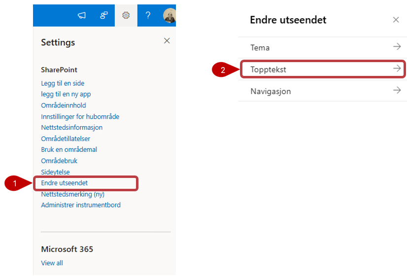
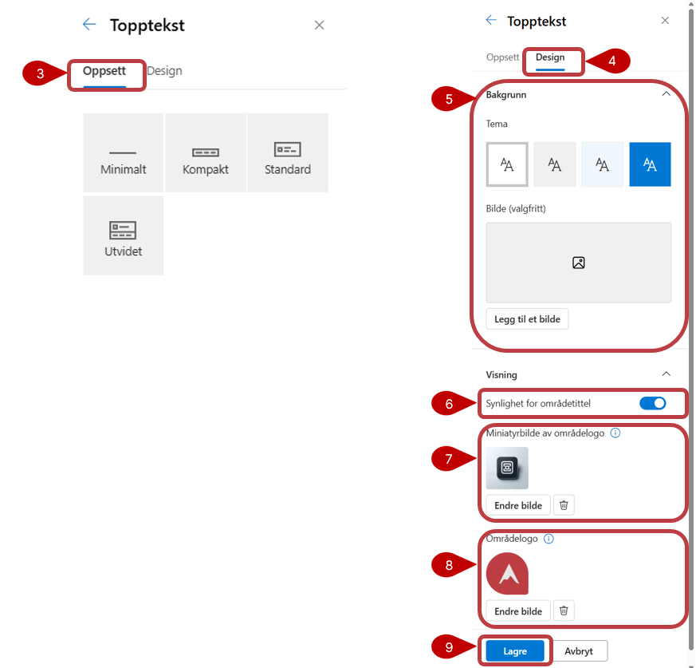
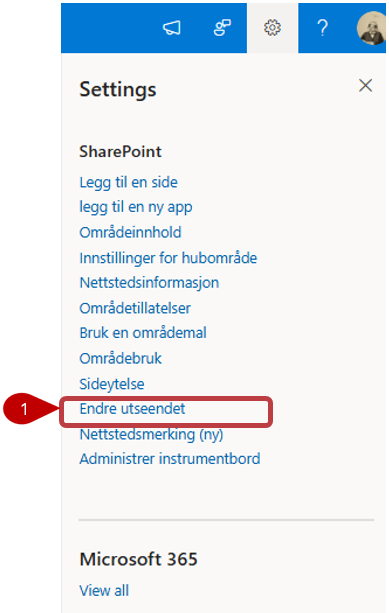
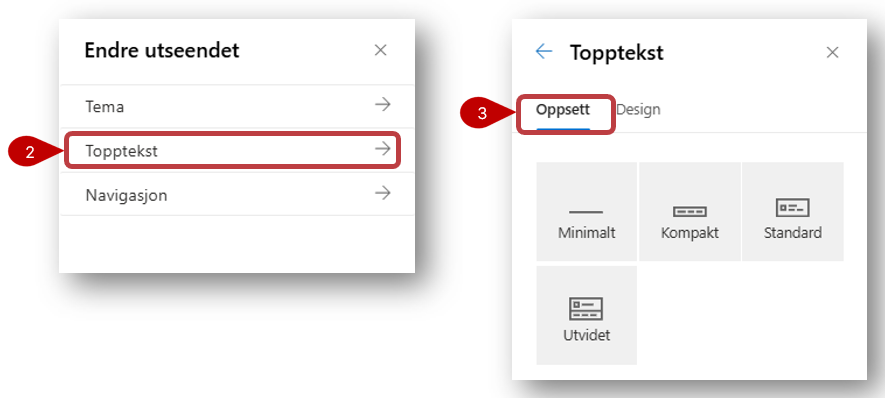
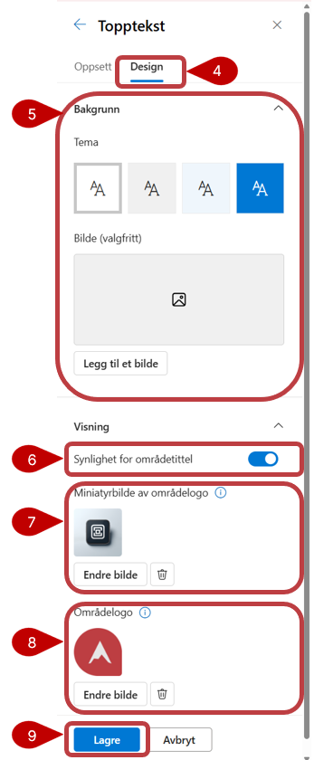

#  Slik endrer du områdeikon på portefølje- og prosjektområde

Områdeikonet for porteføljenivået og prosjektområdet kan endres av områdets eier/ områdeadministrator. Fremgangsmåten er lik både for portefølje- og prosjektnivå, derfor gjelder informasjonen under for begge.

Ikonet endres enkelt ved hjelp av disse stegene:

 

1.  Trykk på tannhjulet øverst i høyre hjørne og velg **Endre utseendet**
2.  Velg **Topptekst** for å endre, sette inn eller fjerne områdelogo.
3.  Du kommer automatisk til fanen **Oppsett** som gir deg mulighet å velge oppsett og format på toppteksten. Standard er det satt til **Kompakt**
4.  Klikk på fanen **Design** for å endre logo, bakgrunn,...
5.  Endre bakgrunnsfarge basert på Temafargene som er satt for området.
6.  **Synlighet for områdetittel** gir deg muligheten til å vise og skjule toppteksten.
7.  **Miniatyrbilde av områdelogo**, miniatyrbilde for område logo som vises i søk, på område-kortet og hvor andre enn kvadratisk logo er nødvendig
8.  **Områdelogo**, logo som vil vises i toppteksten for området, som kan være gjennomsiktig eller ikke-gjennomsiktlig.
9.  Trykk **Lage** for å lagre endringene
 

 
