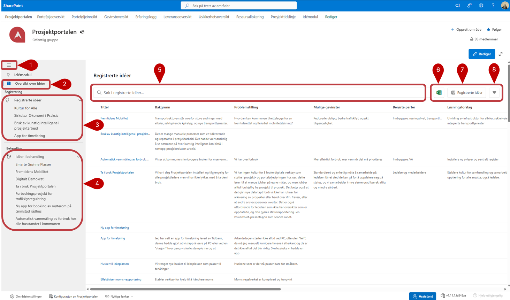

# Prosjekttidslinje
Idémodulen er en visning som gir en oversikt over alle registrerte og behandlede idéer. 
Alle idéer registreres og behandles i lister og modulen er kun en visning over innholdet i disse lister. 
Redigering/oppdatering av innhold samt behandling av idéer må gjennomføres i listene. 

Det foreligger 3 SharePoint lister bak idémodulen

- Idéregistrering
- Idébehandling
- Prosjektdata

Når du klikker deg inn på idémodulen kommer du inn på oversikt over alle idéer. Både registrerte og behandlede. 

**1.** Gjennom å klikke på disse tre linjene åpner du og lukker høyre panelen som gir deg visningene over idéer

**2. Oversikt over idéer** samler 2 visniger under seg Registrering og Behandling.

**3. Registrerte idéer** Her under er alle idéer som er registrert men ikke behandlet, behandlet og er under vurdering eller avvist. Her ser vi ikke idérr dom er godkjent.

**4. Idéer i behandling** Her under er alle idéer som har blitt behandlet og godkjent etter regisgrering. 

**5.** I søkeboksen kan du søke blant alle idéer som er i listen

**6.** Klikk på knappen for å eksportere listen til Excel

**7.** Trykk her for å bytte til andre visninger

**8.** Trykk på ikonen  **"Filtrer"** for å filtrere på ulike verdier.

