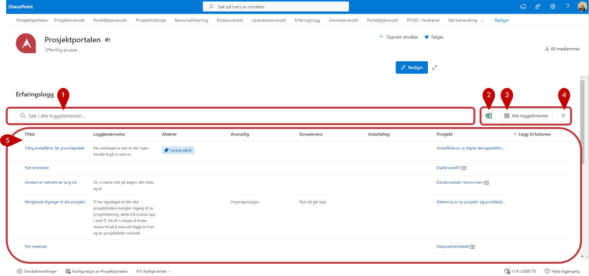
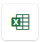
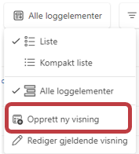

# Erfaringslogg

I erfaringsloggen kan du lære av andres prosjekterfaringer.
Erfaringsloggen viser elementer fra prosjektloggen i prosjekter du har
tilgang til, men bare dersom den som har meldt inn erfaringen i
prosjektene har valgt å publisere erfaringen til erfaringsloggen.

1) Bruk søkefeltet for å finne erfaringer på bakgrunn av alle tilgjengelige felter.
2)  - Knappen benyttes for å eksportere listen til Excel. Hvis du har filtrert listen for å se på spesifikke prosjekter, er det kun de du ser som vil bli eksportert ut. Pass derfor på at eventuell filtrering er i tråd med det du ønsker å eksportere, og tilbakestill filtre om du ønsker å eksportere en oversikt over samtlige prosjekt.
3) Her kan du velge mellom eksisterende visninger, editere visning og **Oprette nye visninger**

    

4) Med -knappen kan du filtrerere basert på tilgjengelige felter.

5)  I denne delen finner du selve oversikten. Alle erfaringer som er delt med porteføljenivået vil vises i dette feltet. Husk at du ser bare erfaringer fra prosjekter du har tilgang til.
    
      **A)** Ved å trykke på prosjektnavnet til den enkelte erfaring vil du bli sendt til tilhørende prosjektområde.
    
      **B)** Ved å klikke på kolonneoverskriften kan du velge å gruppere på enkelte kolonner. (Hvilke kolonner du kan gruppere på er styrt 
             av oppsettet av ‘Prosjektkolonner’ som du finner igjen i **Konfigurasjon av Prosjektportalen** lengst ned på siden.
    
      **C)**  **Konfigurasjon av Prosjektportalen** finner du lengst ned på siden
   
