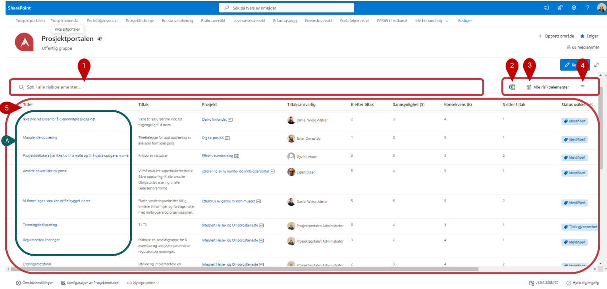
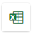

# Usikkerhetsoversikt

Usikkerhetsoversikten viser usikkerheter (det vil si risikoer og muligheter) som er valgt for visning på porteføljenivå i prosjektene. Du ser bare usikkerheter fra de prosjektene som du har tilgang til.

1. Bruk søkefeltet for å finne usikkerhetselementer på bakgrunn av alle tilgjengelige felter.
   
2.  - Knappen benyttes for å eksportere listen til Excel. Hvis du har filtrert listen for å se på spesifikke prosjekter, er det kun de du ser som vil bli eksportert ut. Pass derfor på at eventuell filtrering er i tråd med det du ønsker å eksportere, og tilbakestill filtre om du ønsker å eksportere en oversikt over samtlige prosjekt.

3. Her kan du velge mellom eksisterende visninger, editere visning og **Oprette ny visning**
   
   
   
4. Med -knappen kan du filtrerere basert på tilgjengelige felter.

5. Det er usikkerhetselementene fra de prosjekter som du har tilgang til som vises i dette feltet.

      **A)** Ved å trykke på prosjektnavnet til den enkelte usikkerhet vil du bli sendt til tilhørende prosjektområde.

