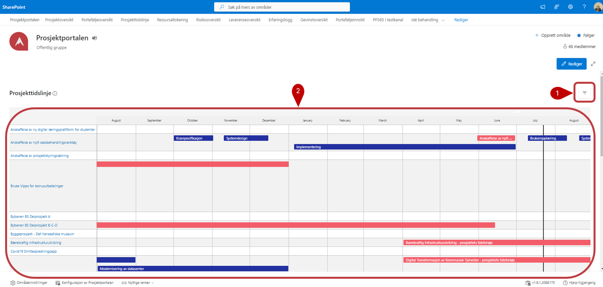

# Prosjekttidslinje

Prosjekttidslinjen viser tidslinjeelementer fra alle prosjekter. Du vil kunne se elementer fra alle prosjekter.

1. Trykk på  for å filtrere på de tilgjengelige feltene.

2. Dette er listen med alle elementer fra prosjektene.

   (Det er mulig å få tilgang til den komplette listen over alle prosjekters tidslinjeelementer gjennom sentrale listen. Elementer kan legges til direkte i den sentrale listen om ønskelig. Men det anbefales å arbeide gjennom prosjektet).
