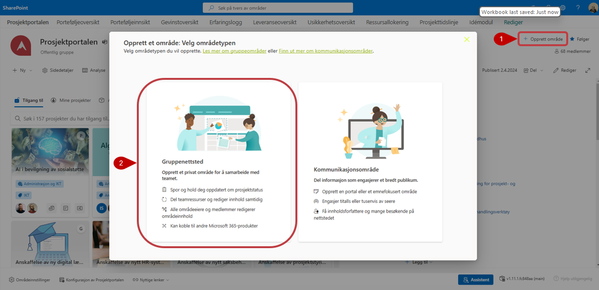
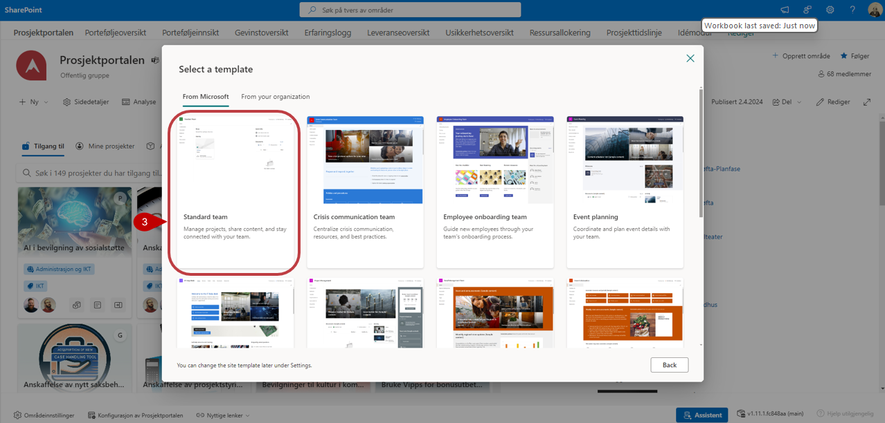
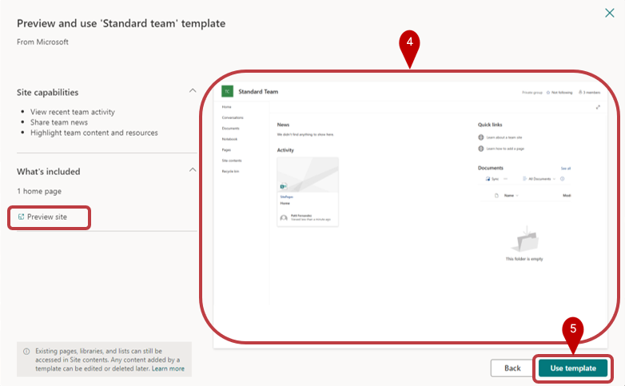
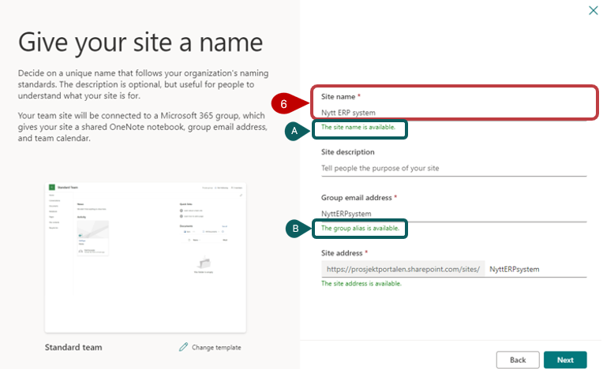
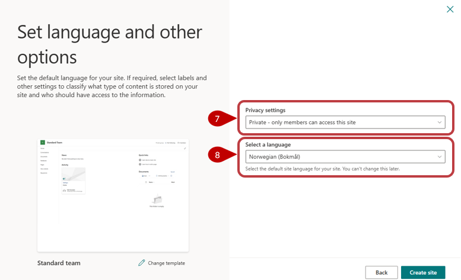
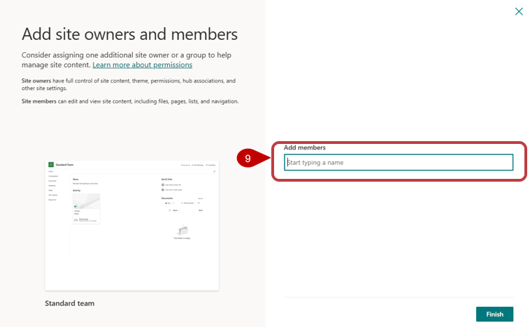
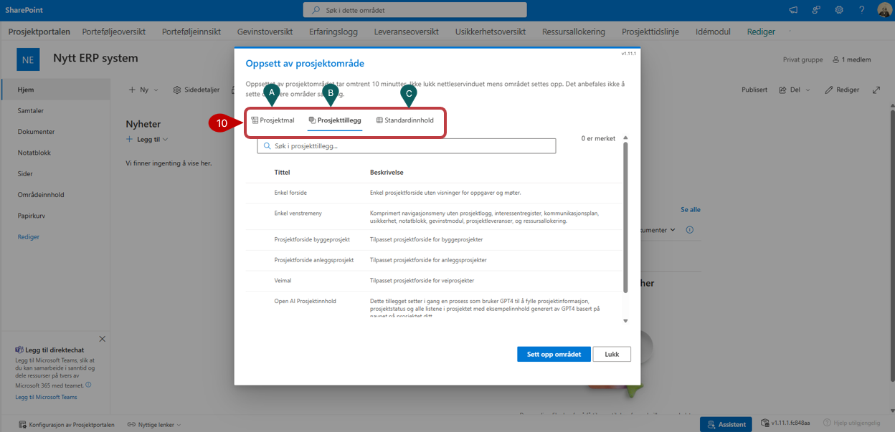
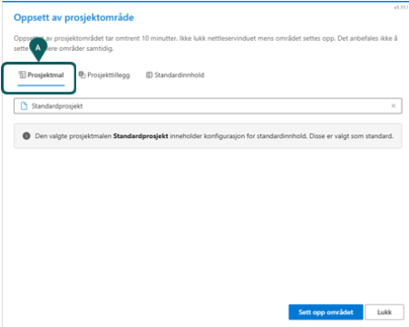
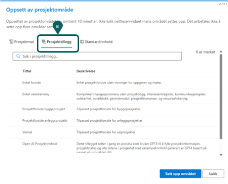
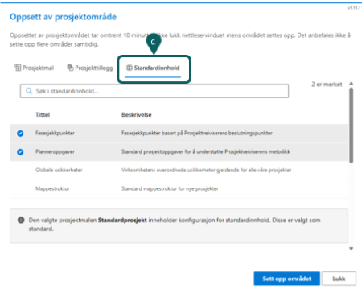

# Opprette et nytt prosjekt

Den som har *eiertilgang* på porteføljenivået, har også rettighet til å opprette nye prosjekter. 
1. Dette gjøres ved å trykke på *Opprett område*-lenken i øvre høyre del på forsiden av Prosjektportalen. 
2. Velg og opprette et "Gruppenettsted/Teamsite" ved å trykke på boksen til venstre.

   
   

3. Dette starter en prosess som bør utføres på som beskervet her under. På neste bild under fanen "Fra Microsoft" Velger du "Standard Team"

   

4. I neste steg får du ser en preview a malen
5. Velg "Use template" for å gå videre
 
 

6. Gi ditt prosjekt (området) et navn
   
   **A)** Verifiser at "Områdenavnet" er tilgjengelig
   
   **B)** Verifiser at gruppealiaset er tilgjengelig

8. Tilgangsinnstilling settes til enten privat (forhåndsvalg) eller offentlig.
9. Språk må settes til «Norsk» da dette er eneste språk som er støttet i nåværende utgave av Prosjektportalen. Velg deretter "Opprett site" for å gå videre.
10. Du kan velge å legge til medlemmer i denne fasen, eller gjøre det etter at prosjektet er opprettet. Velg Ferdig.

10. Prosjektområdet blir opprettet og du vil nå bli videresendt til det nye prosjektområdet.
Det første du trenger å gjøre er å sette opp området med ønsket innhold.
Alle muligheter gjøres tilgjengelig på de 3 sidene:

   **A**)Prosjektmal 
   
   **B**)Prosjekttillegg 
   
   **C**) Standardinnhold

Hva som skal ligge tilgjengelig på disse sidene er styrt av porteføljeadministrator. Videre følger en forklaring på hva du kan tilgjengeliggjøre i det nye prosjektet.

**A)Prosjektmal** - På denne siden velger du hvilken mal prosjektet skal settes opp etter. Her kan du velge mellom de ulike prosjektmalene som er installert.

**B)Prosjekttillegg** - Her velger du hvilke tillegg som du ønsker med i dette prosjektet.

**C) Standardinnhold** - Standardinnhold er faktiske data som man kan legges til i de enkelte lister og biblioteker som finnes på prosjektområdet.

