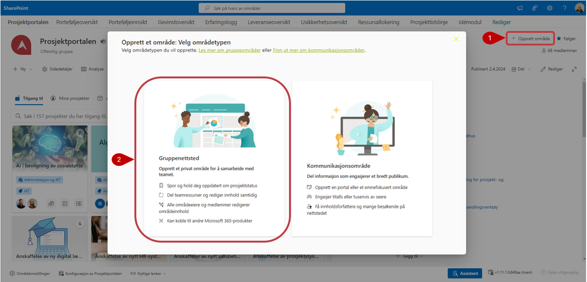
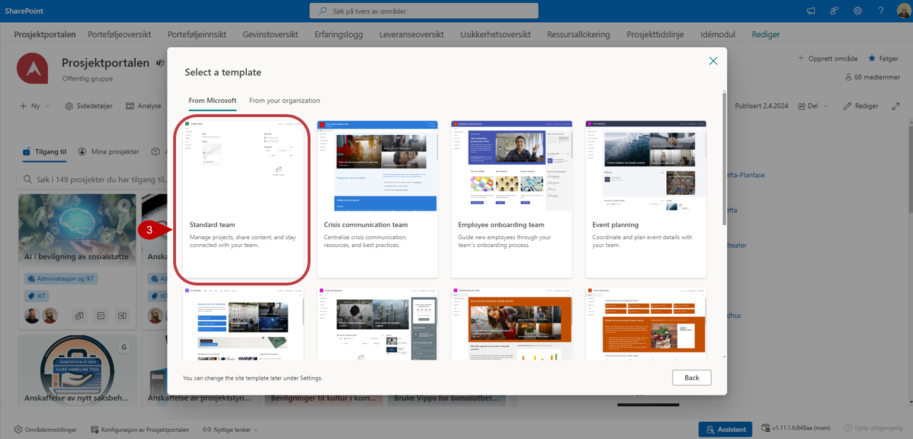
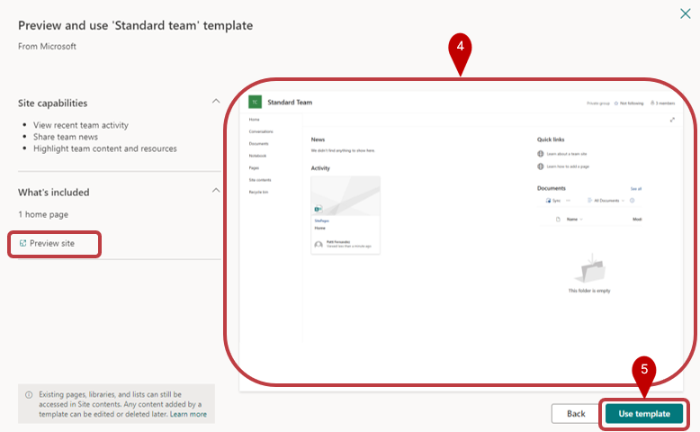
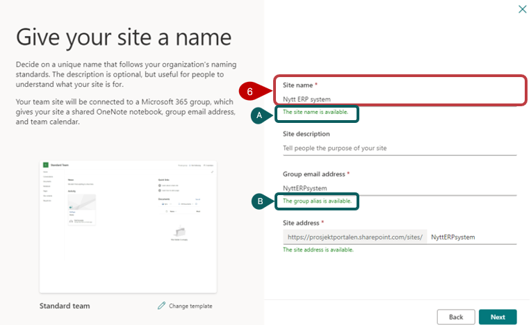
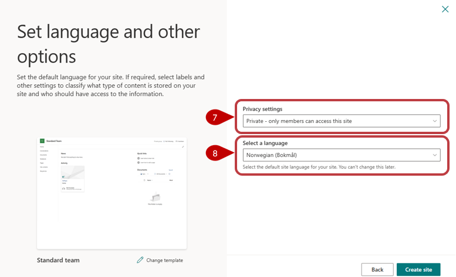
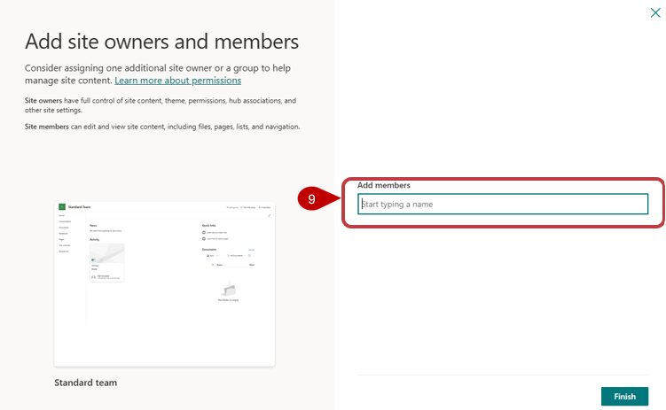
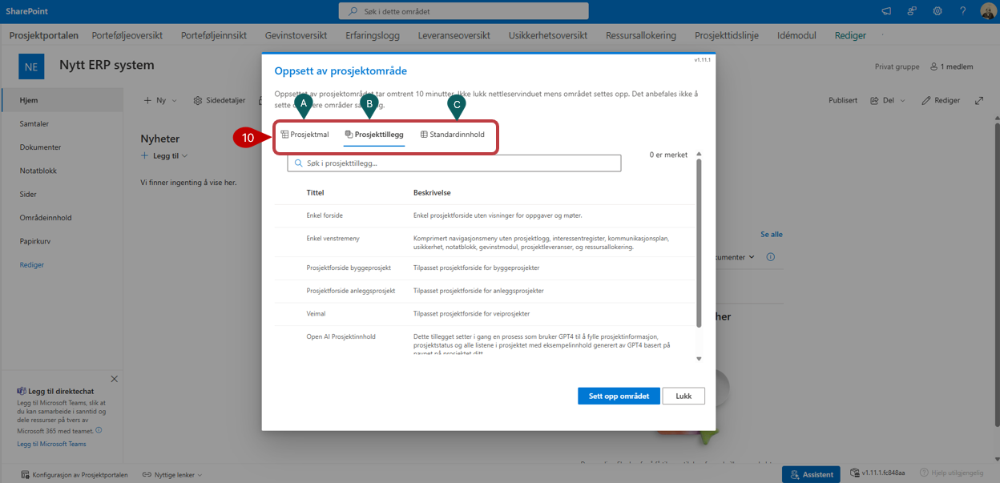

# Opprette et nytt prosjekt

Den som har *eiertilgang* på porteføljenivået, har også rettighet til å opprette nye prosjekter. 
1. Dette gjøres ved å trykke på *Opprett område*-lenken i øvre høyre del på forsiden av Prosjektportalen. 
2. Velg og opprette et "Gruppenettsted/Teamsite" ved å trykke på boksen til venstre.
    

3. Dette starter en prosess som bør utføres på som beskervet her under. På neste bild under fanen "Fra Microsoft" Velger du "Standard Team"
   

4. I neste steg får du ser en preview a malen
5. Velg "Use template" for å gå videre
   

6. Gi ditt prosjekt (området) et navn
**A)** Verifiser at "Områdenavnet" er tilgjengelig
**B)** Verifiser at gruppealiaset er tilgjengelig
   

7. Tilgangsinnstilling settes til enten privat (forhåndsvalg) eller offentlig.
8. Språk må settes til «Norsk» da dette er eneste språk som er støttet i nåværende utgave av Prosjektportalen. Velg deretter "Opprett site" for å gå videre.
9. Du kan velge å legge til medlemmer i denne fasen, eller gjøre det etter at prosjektet er opprettet. Velg Ferdig.
   
 
10. Prosjektområdet blir opprettet. I denne steg kan du velge å sette opp området med standard innhold eller velge å legge til "Prosjektillegg" og "Standardinnhold" utover det som ligger som standard i malen. Velg deretter "Sett opp område".

