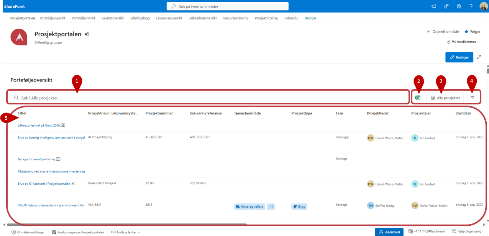
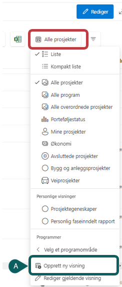
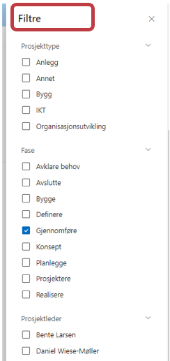

# Porteføljeoversikt

Porteføljeoversikten gir et øyeblikksbilde over alle prosjektene i
porteføljen. Denne oversikten kan enkelt endres slik at du ser den
informasjonen du trenger.

1. Bruk søkefeltet for å filtrere listen på ønskede nøkkelord.
2. Trykk  for å eksportere den visningen du har valgt til et Excel-ark som automatisk lastes ned til datamaskinen din.
3. Trykk på **Alle prosjekter** for å velge andre visninger som Porteføljestatus, Mine prosjekter og Økonomi. Her vises også eventuelle tilpassede visninger som er opprettet for denne porteføljen.
   
     **A)** Trykk på ***"Opprett ny visning"*** for å opprette ny visning.
     Rettighet til å opprette nye visninger er styrt på listenivå. Listen er tilgjengelig gjennom konfigurasjons-siden for Prosjektportalen 365.***
 
      
   
5. Trykk på ikonen  **"Filtrer"** for å filtrere og velge flere felter å vise. Her kan du også angi et eller flere felter som du ønsker å filtrere på.

  
      
   
7. Her vises informasjon om prosjektene på bakgrunn av visningen du har valgt. Trykk på tittelen til et prosjekt for å gå til prosjektrommet.
