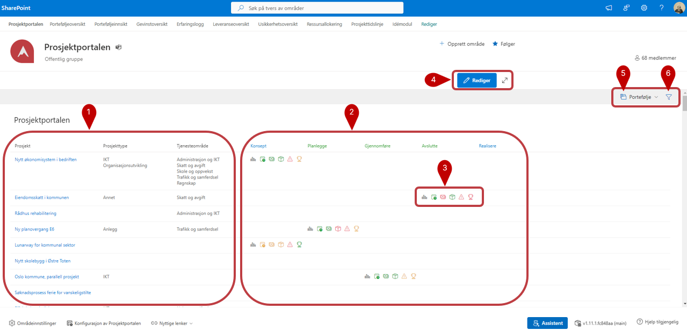
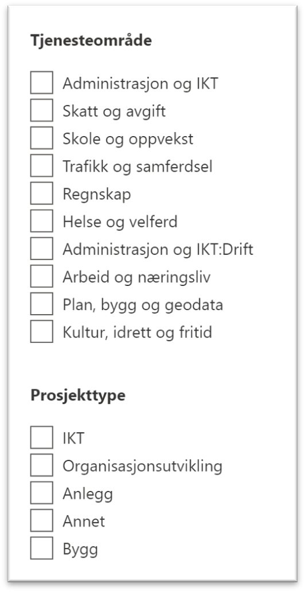
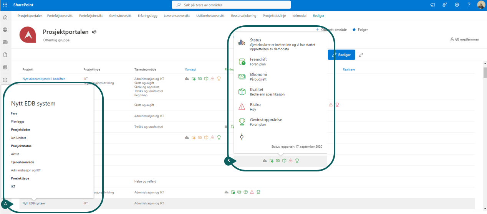
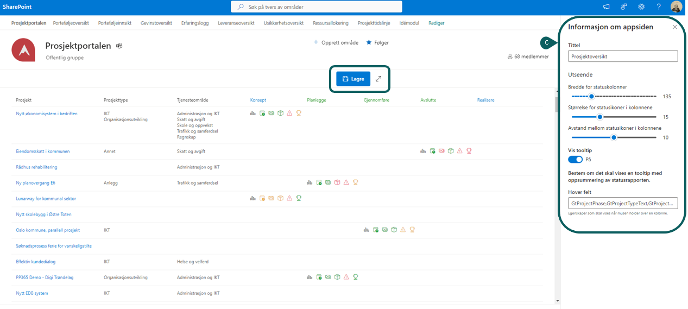
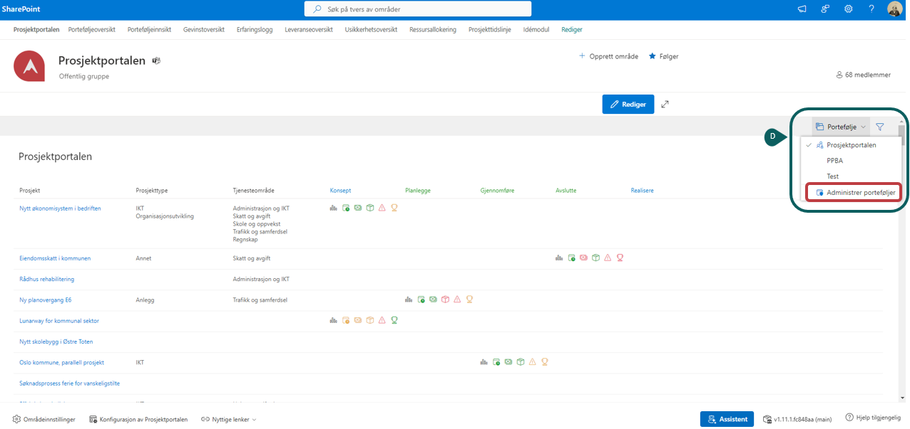
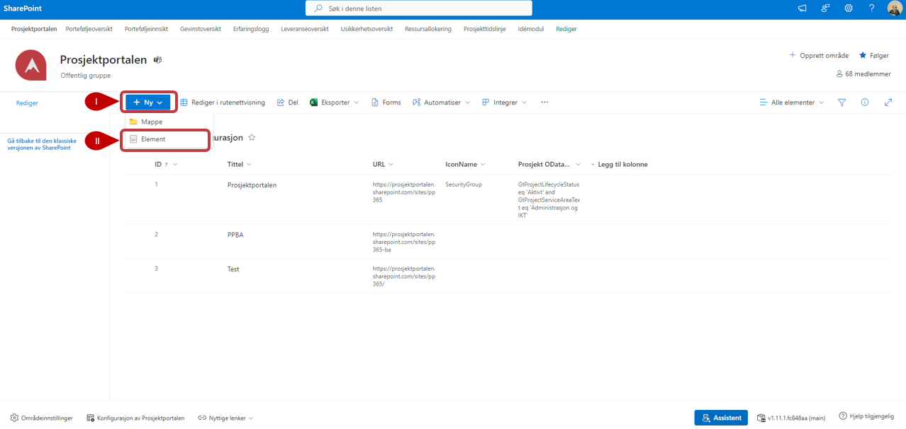

  

# Prosjektoversikt

Prosjektoversikt gir en oversikt over alle prosjektene på tvers av porteføljer. 

1. **Prosjektoversikt:** Har ser du en oversikt over prosjekter, hvilken prosjekttype og tjenesteområde prosjektet tilhører. [Se bild og mer info under (A)](#A-1).

2. **Prosjektfase:** Har ser du hvilken fase prosjektene er i. 
3. **Status ikoner:** Dessa ikoner gir en visuell og øyeblikkelig oversikt med status for prosjekter i pågående fase . [Se bild og mer info under (B)](#prosjektoversikt-1).

4.  **Rediger Statusvisning:** Her kan man endre utseende på statusikoner.[Se bild og mer info under (C)](#prosjektoversikt-1).
 
5. **Portfølje:** Her kan du administrere porteføljer du har tilgang til samt bytte til andre porteføljer. [Se bild og mer info under (D)](#prosjektoversikt-1).

6. **Filtrering:** Klikk på -knappen og du kan filtrere på *Tjenesteområde* eller *Prosjekttype*. 

  

## Detaljert beskrivelse av punktene ovan
#### Prosjektoversikt
 **A)** Gjennom at holde muspekeren over prosjektnavnet i første kolumnen får man opp mer informasjon og detaljer om prosjektet. 
 
 **B)** Hold muspekeren over Statusikonene for å få mer detaljert informasjon om ststus på prosjektet

        
 **C)** Klikk på Rediger for å få opp en sidepanel der du kan redigere utseende på Statusikoner så som bredde, størrelse og avstand.  
        Lagre dine endringer
  
   

  **D)** Ved å trykke på ***Portefølje*** kan du bytte mellom ulike Porteføljer. Det er mulig å legge til flere Porteføljer, trykk på **Administrer porteføljer** å åpne porteføljelisten.

   
  ***For å legge til ny portefølje:***
    
   ***I)  Trykk på Ny***
    
   ***II) Trykk på **Element** og legg inn ny portefølje.***
     

   
