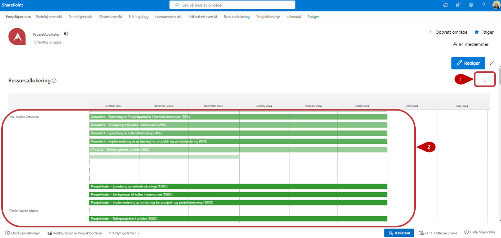

# Ressursallokering

Ressursallokeringen viser de ressursallokeringene som er lagt inn i
prosjektene eller i den sentrale allokeringslisten. Du kan bare se
allokeringer fra de prosjektene du har tilgang til.

1. Trykk på  for å filtrere på de tilgjengelige feltene.

2. Dette er listen med alle allokeringer fra prosjektene og fra sentral allokeringsliste.

