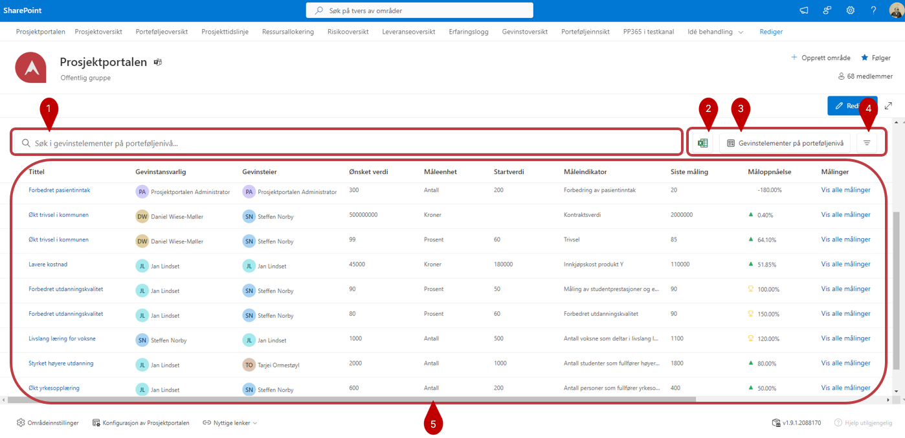
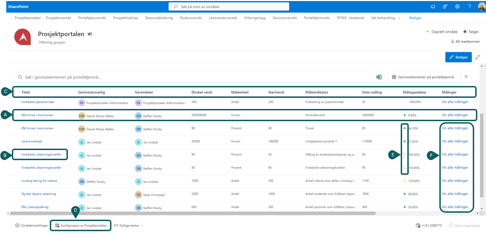

# Gevinstoversikt

1) Bruk søkefeltet for å finne gevinster på bakgrunn av alle tilgjengelige felter.
2)  - Knappen benyttes for å eksportere listen til Excel. Hvis du har filtrert listen for å se på spesifikke prosjekter, er det kun de du ser som vil bli eksportert ut. Pass derfor på at eventuell filtrering er i tråd med det du ønsker å eksportere, og tilbakestill filtre om du ønsker å eksportere en oversikt over samtlige prosjekt.
3) Her kan du velge mellom eksisterende visninger, editere visning og **Oprette nye visning**

    

4) Med -knappen kan du filtrerere basert på tilgjengelige felter.

5)  I denne delen finner du selve oversikten:
   

**A)** Hver linje er en gevinst.

**B)** For å gå til gevinsten i prosjektrommet kan du trykke på tittelen til gevinsten.

**C)** Ved å klikke på kolonneoverskriften kan du velge å gruppere på enkelte kolonner. (Hvilke kolonner du kan gruppere på er styrt av     
      oppsettet av ‘Prosjektkolonner’ som du finner igjen i *Konfigurasjon av Prosjektportalen* 
      
**D)** **Konfigurasjon av Prosjektportalen** finner du lengst ned på siden

**E)** Negativ eller positiv utvikling i måloppnåelse vil indikeres med symbolene.

**F)** Helt til høyre på hver enkelt gevinstlinje kan du velge å vise målingene som ligger til grunn på den enkelte gevinst

 

