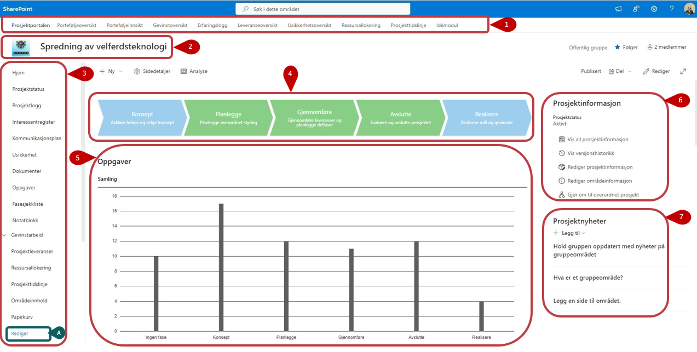
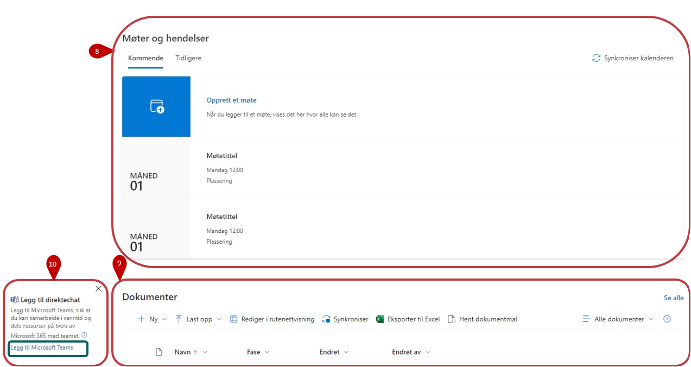

# Prosjektområdet

Et *prosjektområde* omfatter et enkelt prosjekt og alt innholdet i prosjektet. Hver installasjon av Prosjektportalen kan ha mange
prosjektområder.

## Forsiden

Før egenskaper for prosjektet er fylt ut, vil forsiden se ut som bildet under. Ser under for bildeforklaringen. Etter at prosjektets fase er satt, vil kun dokumenter og eventuelle usikkerheter knyttet opp mot gjeldende fase vises. Det første du bør gjøre er å redigere egenskapene til prosjektet og fylle inn relevant prosjektinformasjon, [informasjon om hvordan finnes her](41-ProsjektinformasjonOgFasesetting.html)

1.  **Porteføljemenyen** vil til enhver tid kunne føre deg til valgt side på porteføljenivået.

2.  **Områdeikonet** peker tilbake til forsiden av prosjektområdet. Ikonet kan endres for hvert prosjekt, se kapittel 2.6 for instruksjoner om hvordan dette gjøres.

3. **Venstremenyen** inneholder lenker til alle listene og verktøyene i prosjektområdet. I listene vil du ha tilgang til alle elementer uavhengig av fase, og det er også her det er enklest å legge til, endre eller slette innhold i lister og biblioteker
    .     
   ***A)*** Venstremenyen kan enkelt tilpasses til prosjektområdebrukernes behov ved å trykke på **Rediger**.

4.  **Faseviseren** markerer den fasen som prosjektet befinner seg i. Du kan endre fase, gå gjennom sjekkpunkter og få oversikt over hva som er gjennomført av sjekkpunkter på de ulike fasene.

5.  **Oppgaver** viser en oversikt over alle prosjektoppgaver som ligger i Planner. Ved å redigere forsiden, kan du også endre hvilken visning du ønsker på dette feltet.

6.  **Prosjektinformasjon** innholder nøkkelinformasjon om prosjektet. Informasjon som legges inn her, blir også synlig på porteføljenivå. Du kan også endre tittel og beskrivelse for prosjektet i dette feltet.

7.  **Prosjektnyheter** fungerer som prosjektets informasjonskanal. Prosjektnyheter som publiseres i prosjektet blir aggregert opp og vises på porteføljenivå. 

8.  **Møter og hendelser** vil vise de hendelser som er lagt inn i gruppekalenderen i Outlook.

9.  **Dokumenter (gjeldende fase)** viser alle dokumenter tilknyttet den fasen prosjektet er i. Hvis man ikke har satt fase vil alle dokumenter være synlig i denne komponenten.

10. **Teamskobling** opprettes ved å velge "Legg til Microsoft Teams". Da vil et Team bli opprettet og koblet til Office365-området som prosjektet representerer
       
  

