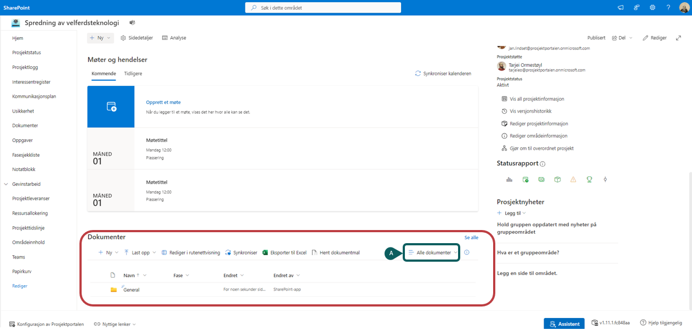

# Dokumenter
{: .no_toc}

## Innhold
{: .no_toc .text-delta }

1. TOC
{:toc}

SharePoint og Prosjektportalen har fantastiske verktøy for å dele, skrive sammen på og vedlikeholde prosjektdokumenter. 
Dette avsnittet tar for seg grunnleggende dokumenthåndtering. For mer informasjon om dokumenthåndtering gå til [Microsoft sine egne supportsider](https://support.office.com/nb-no/article/Hva-er-et-dokumentbibliotek-3b5976dd-65cf-4c9e-bf5a-713c10ca2872?ui=nb-NO&rs=nb-NO&ad=NO).

## Dokumentvisning på forsiden av prosjektområdet

På forsiden av prosjektområdet er det bygget inn en visning av prosjektdokumenter. Denne visningen fremstiller dokumentene basert på det som heter «standard visning». En god praksis kan være å la visningen «Gjeldende fase» stå som «standard visning», på denne måten er det dokumenter tilknyttet den fasen prosjektet er i som vises på prosjektets hjemmeside.

  **A)** Hvilken visning som er gjeldende ser du her 

### Redigere gjeldende visning
Hva som skal være standardvisning kan defineres i dokumentbiblioteket. Her ligger alle dokumentene i prosjektet.

1. Dokumentbiblioteket  er tilgjengelig i venstremenyen. 
2. Åpne visningsmenyen på høyre side.
3. Velg visningen du ønsker å vise som standard
4. Velg deretter å gjøre valgt visning til gjelende

Når prosjektet ble opprettet var det et valg for å legge et sett med standarddokumenter fra Porteføljeområdet inn i prosjektet. Disse er som regel allerede knyttet opp mot ulike faser i prosjektet. 
I tillegg kan deltakerne selv legge til, fjerne og redigere dokumenter i prosjektområdet.

## Laste opp dokument(er) i prosjektområdet
I tillegg til å legge inn standarddokumenter ved opprettelse av prosjektet, er det flere metoder som kan benyttes for å få dokumenter inn i et prosjekt på. Vi beskriver disse kort i denne manualen, med fokus på *Hent dokumentmal* som er en spesialtilpasset metode for Prosjektportalen. 

Det kan være begrensninger på enkelte av funksjonene. Dette gjelder forhold som styres fra sentralt hold og som Prosjektportalen dermed ikke kan overstyre. I tillegg kan du oppleve at nettlesere oppfører seg noe ulikt.

Disse er de ulike metodene som vil bli beskrevet:
1. Hent dokumentmal
2. Ny knappen
3. Last opp-knappen
4. Dra-og-slipp-metoden
  

### Hent dokumentmal
Med denne funksjonen er det dokumentene som ligger i ***Malbiblioteket*** på Porteføljenivå som benyttes som kilde. Ved å trykke på **Hent dokumentmal** får du en oversikt over dokumentmalene som ligger der.

Her vil det alltid være siste utgave av malen som blir tatt med over til prosjektet. Dette er med på å styrke samhandlingen rundt bruk av maler, og sikre at man til enhver tid arbeider med siste mal.

Disse malene vil også allerede kunne være merket med relevant prosjektfase.
1. Marker malen du ønsker å hente inn
2. Klikk på velg

### Ny-knappen
Med "Ny"-knappen kan du opprette et nytt dokument i dokumentbiblioteket. Trykk på **Ny** og velg hvilken type dokumnet du vil opprette.
Hva slags dokumenter du kan opprette er styrt av prosjektområdets innholdstyper.

### Last opp-knappen
Du kan også benytte deg av "Last opp"-knappen som ligger i toppmenyen i dokumentbiblioteket. Her blar du deg frem til de aktuelle dokumentene på din egen PC, og velger disse for opplasting.

Dokumentene du laster opp blir ikke flyttet, men kopiert inn i biblioteket.

### Dra-og-slipp-metoden

Har du dokumenter liggende på en filkatalog eller som vedlegg i en epost er det lett å kopiere disse rett inn i dokumentbiblioteket ved å markere de i systemet de ligger, og kort og greit dra-og-slippe dem inn i dokumentbiblioteket. 

## Redigere egenskapene til et dokument
Du kan redigere egenskapene til et dokument. Om du ønsker å (for eksempel) endre fase på et dokument kan du gjøre dette på flere måter direkte i biblioteket:
- Rediger i rutenettvisning
- Elipsemenyen
- Detaljruten
  
### Rediger i rutenettvisning
  1. Trykk på **Rediger i rutenettvisning** for å gjøre endringer direkte i dokumentlisten.
  2. Gjør dine endringer i dokumentegenskapene
  3. Avslutte rutenettvisning etterpå for å lagre endringene.

  
  

### Elipsemenyen 
   1. Trykk på Elipsemenyen
   2.  Velg mer
   3.  Velg egenskaper og ny side åpnes og du kan editere egenskapene
      
 
 
### Detaljruten
  1. Marker dokumentet du vil endre egenskaper på
  2. Trykk på "Detalj"-knappen
  3. En panel åpnes på høyre siden og du kan redigere egenskapene for dokumentet
    

## Versjonslogg

Versjonsloggen er et fantastisk verktøy som gir deg kontroll over ulike versjoner av et dokument uten at det tar opp ekstra plass, og uten behov for å kalle dokumentet "versjon 1.0, 2.0,
3.0" osv.

For hver lagring som blir gjort, blir en ny versjon av dokumentet opprettet automatisk. Ved samskriving skjer dette omtrent hvert minutt.

Det er to veier til å finne versjonsloggen, marker dokumentet: 
- Klikke på **Elipsemenyen** på dokumentet
- Hæyreklikk på dokumentet
  

1. I versjonsloggen kan du se på tidligere versjoner  på dato og tidspunkt i "Endret"-kolonnen 
2. Trykk på nedtrekkspilen som du ser hvis du drar musepekeren over en versjon for å få se hvilke valg du har.
3. Gjennopprett dokumentet fra tidligere versjon hvis ønskelig. 
Når du gjenoppretter en tidligere versjon, blir den nåværende versjonen lagret i versjonsloggen.

 

