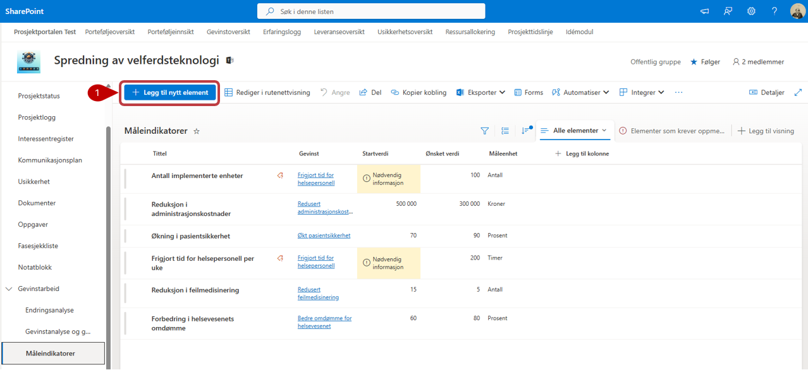
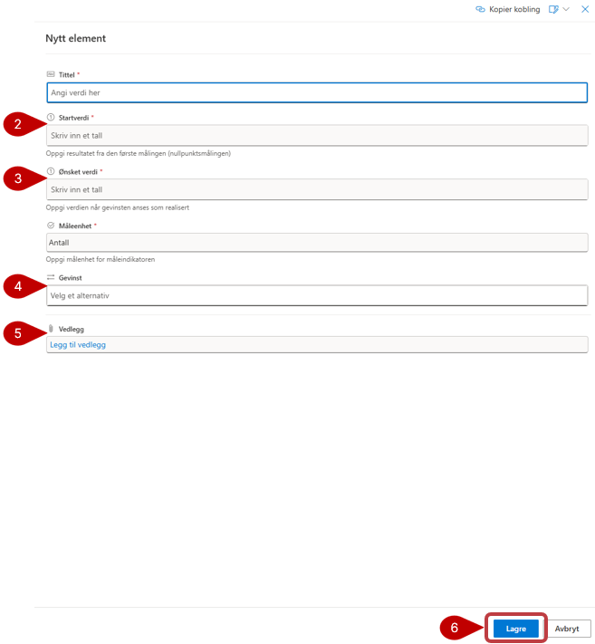

# Måleindikatorer

Med måleindikatorer setter du opp hvilke konkrete måleparameter du ønsker å måle i prosjektet.
Les under her for mer informasjon om opprettelse av nytt element i listen

Fyll ut feltene med relevant informasjon. Legg merke til at noen av feltene har en stjerne ved navnet. Disse er obligatoriske å fylle ut, og du får ikke lagret før det er gjort.
1. Trykk på **Legg til nytt element** for å opprette ny måleparameter.
2. Hver enkelt måleindikator settes opp med **startverdi**
3. Hver enkelt måleindikator settes opp med **startverdi**
4. Knytt måleindikator til den gevinsten den har påvirkning mot.
5. **Vedlegg** kan legges til. Merk at disse vedleggene bare vil bli lagret i denne listen, og blir ikke vist i dokumentbiblioteket.
6. **Lagre** i bunn av listen når du er ferdig

