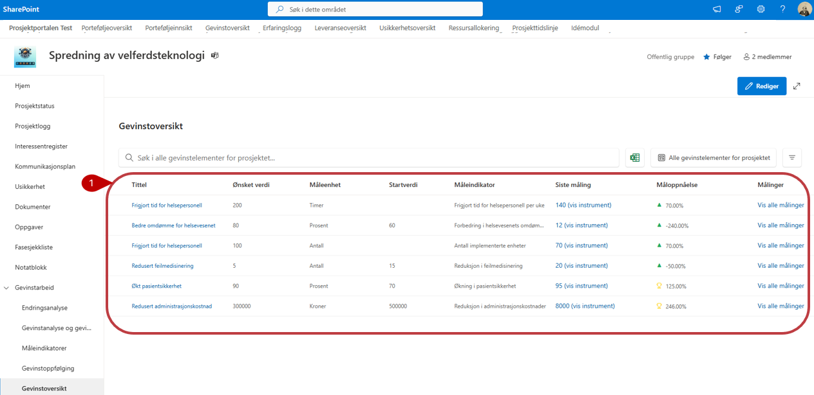
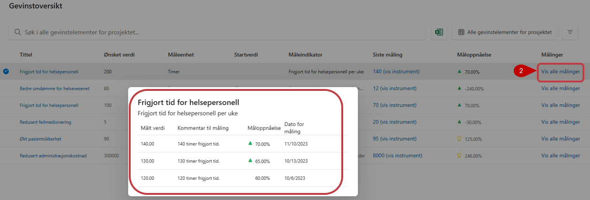
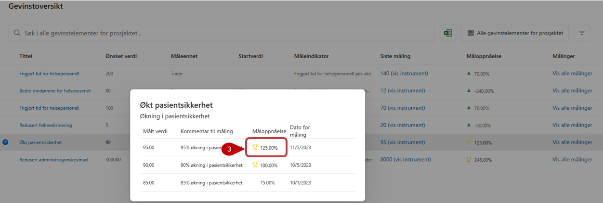

# Gevinstoversikt

Gevinstoversikten blir automatisk generert når det er registrert gevinster, og målinger av gevinster, i prosjektet. 

1. Her får deltagere et oversiktsbilde over gevinster, samt status på disse indikert med tall og piler.

3. Ved å klikke på **Vis alle målinger** til høyre på en av linjene, vil du kunne se alle målinger utført for denne gevinsten.

4. Hvis måloppnåelsen er større enn 100% vil en liten pokal dukke opp ved siden av resultatet som vist under:

All tilgjengelig informasjon i gevinstoversikten vises også på porteføljenivå for de som har tilgang til prosjektet.
