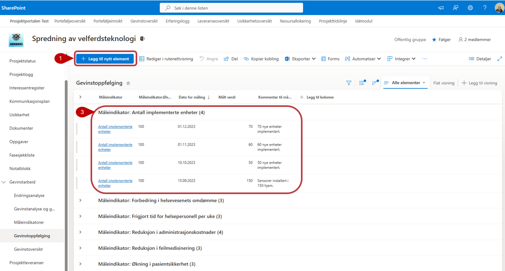
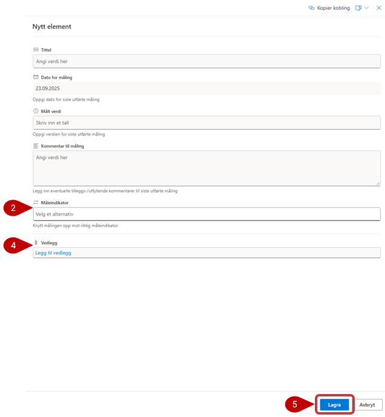

# Gevinstoppfølging

Dette er et verktøy for å utføre målinger på gevinster, sånn at du kan følge med på utviklingen i henhold til målet som er satt.

Fyll ut feltene med relevant informasjon. Legg merke til at noen av feltene har en stjerne ved navnet. Disse er obligatoriske å fylle ut, og du får ikke lagret før det er gjort.
1. Trykk på **Legg til nytt element** for å opprette ny gevinsmåling.
2. Ved registrering av en måling velger du hvilken **måleindikator** den aktuelle målingen gjelder for.
3. I listen vil da alle målinger bli gruppert inn under sin tilhørende måleindikator.
4. **Vedlegg** kan legges til. Merk at disse vedleggene bare vil bli lagret i denne listen, og blir ikke vist i dokumentbiblioteket.
5. **Lagre** i bunn av listen når du er ferdig

Resultater fra gevinstoppfølgingen blir automatisk oppdatert i gevinstoversikten på porteføljenivå.

