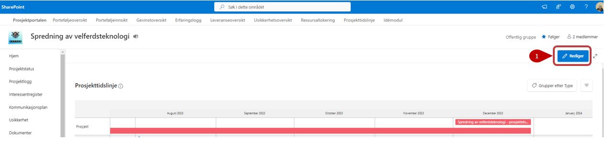
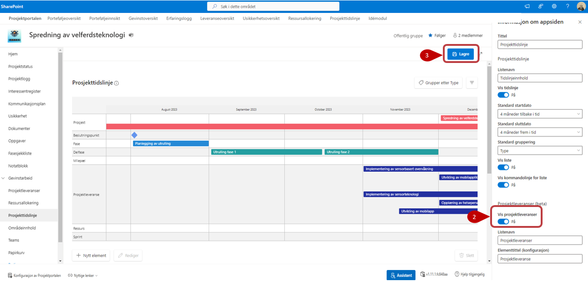
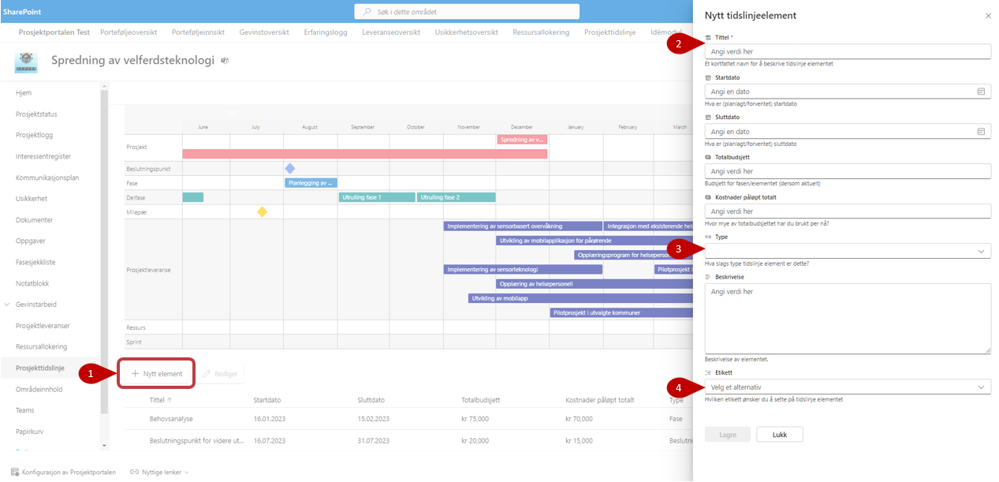
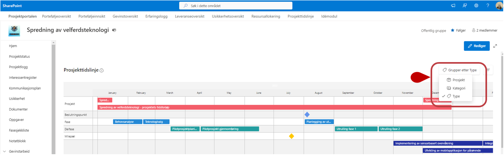
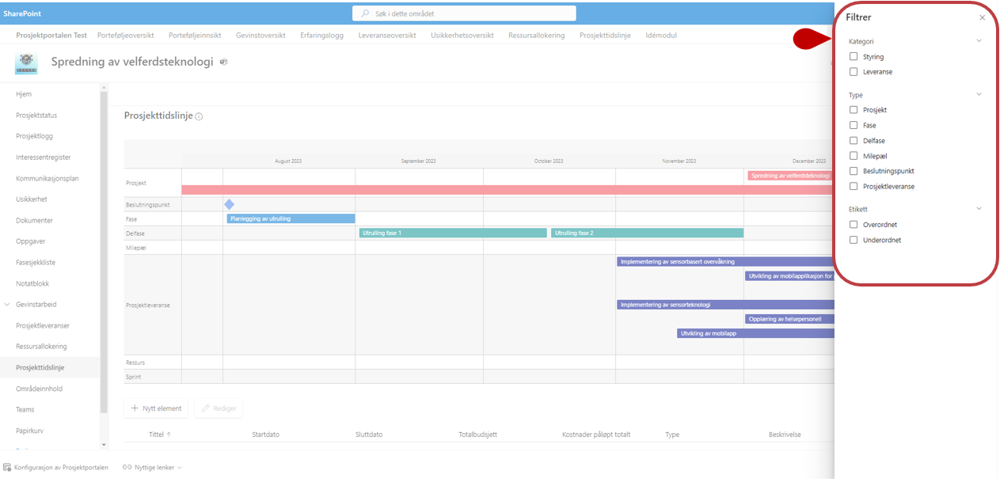

# Prosjekttidslinje
{: .no_toc}

## Innhold
{: .no_toc .text-delta }

1. TOC
{:toc}

# Prosjekttidslinje
Her listes listeelementene for prosjektet i en visuell visning. 
Her kan du redigere og legge til nye elementer. Dette vil synkroniseres til listen på hubområdet. 

For å zoome inn/ut i tidslinje bildet bruk **ALT+Musehjul**

## Rediger egenskaper
1. Det er mulig å redigere visningen gjennom å trykke på Rediger. Da åpnes en panel på høyre siden.
2. Her kan du velge å vise frem prosjektleveranser gjennom å velge "På/Av" på bryteren.
3. Lagre endringene dine

## Legg til nytt element

1. **Nytt element** - Trykk for opprettelse av nytt element og en panel åpnes på høyre siden. Fyll ut feltene med relevant informasjon.
2. **Tittel** - Feltet er markert med stjerne, disse er obligatoriske å fylle ut, og du får ikke lagret før det er gjort.
3. **Type** - Trykk inn på feltet for å velge mellom frhåndsdefinerte verdier på element type. Disse blir synliggjort på tidslinjen med ulike symboler og farger. Vedrier som du kan velge mellom er:
    - Fase
    - Delfase
    - Milepæl
    - Beslutningspunkt
    - ressurs
    - Sprint
4. **Etikett** - Velg en etikett for å enklere kunne filtrere på elementene. Du kan sette opp forhåndsdefinerte verdier og disse verdiene kan tilpasses til dine behov. De forhåndsdefinerte valgene her er:
    - Overordnet
    - Underordnet

      
## Redigere eksisterende element 

1. Marker elementet du vil redigere. 
2. Trykk på rediger og en panel åpnes på høyre siden og du kan enkelt redigere elementet.  
3. **Slett** Trykk på  for å slette elementet fra listen.

 
## Gruppering

Du kan velge å gruppere visningen med disse grupperingvalgene:

- Prosjekt
- Kategori
- Type

## Filtrering

Visningen kan filtreres gjennom å trykke på -knappen. Her kan man filtrere på:
- Kategori
- Type
- Etikett

