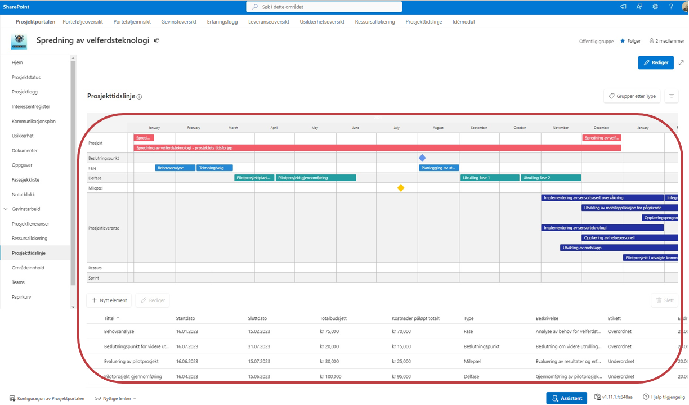

# Prosjekttidslinje
Her listes listeelementene for prosjektet i en visuell visning. 
Her kan du redigere og legge til nye elementer. Dette vil synkroniseres til listen på hubområdet. 

**For å zoome inn/ut i tidslinje bruk ALT+Musehjul**
 
1. Legg til nytt element
2. 
3.
4.

**Legg til nytt element** - Trykk for opprettelse av nytt element og en panel åpnes på høyre siden. Fyll ut feltene med relevant informasjon.
- Feltet **Tittel** er markert med stjerne, disse er obligatoriske å fylle ut, og du får ikke lagret før det er gjort.
- Trykk inn på feltet for å velge mellom frhåndsdefinerte verdier på **Type**. Disse blir sunliggjort på tidslinjen med ulike symboler og farger.  Vedrier som du kan velge mellom er:
    - Fase
    - Delfase
    - Milepæl
    - Beslutningspunkt
- **Etikett** - Velg en etikett for å enklere kunne filtrere på elementene. Du kan sette opp forhåndsdefinerte valg og disse valgene kan tilpasses til dine behov. De forhåndsdefinerte valgene her er:
    - Overordnet
    - Underordnet
      
**Redigere eksisterende element** - Marker elementet du vil redigere. 
  Trykk på rediger og en panel åpnes på høyre siden og du kan enkelt redigere elementet. 
  Trykk på **SLett** for å slette elementet fra listen.
  
**Gruppering** -Du kan velge å gruppere visningen med disse grupperingvalgene:
- Prosjekt
- Kategori
- Type
 
 
**Filtrering** - Visningen kan filtreres gjennom å trykke på -knappen. Her kan man filtrere på 
- Kategori
- Type
- Etikett

**Rediger**
Visningen kan redigeres enda mer gjennom å trykke på Rediger. Her kan du velge å vise frem prosjektleveranser gjennom å velge "På/Av" på bryteren.

-----------------------
# Prosjekttidslinje
Her listes listeelementene for prosjektet. Her kan du redigere og legge til nye elementer. Dette vil synkroniseres til listen på hubområdet. 
## Zoome inn/ut i tidslinje:
For å zoome inn/ut i tidslinje bruk ALT+Musehjul
Tekst og bilder
 
 
 
 
 
 
