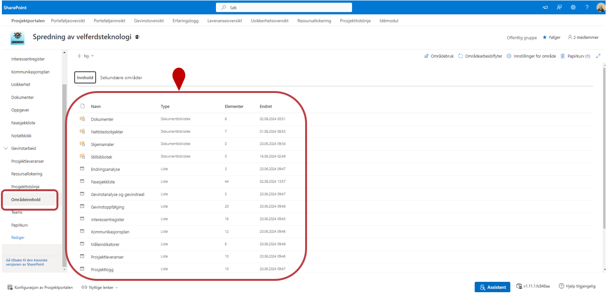
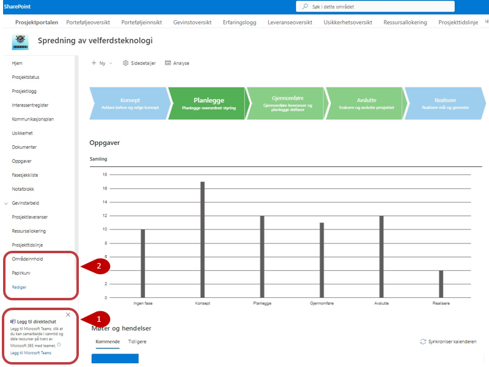
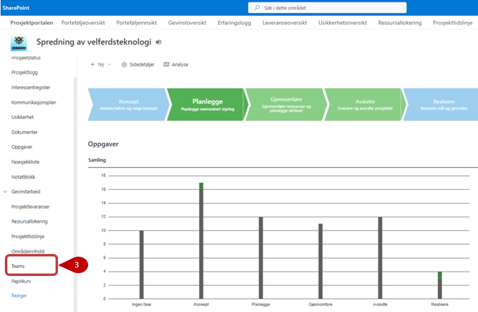
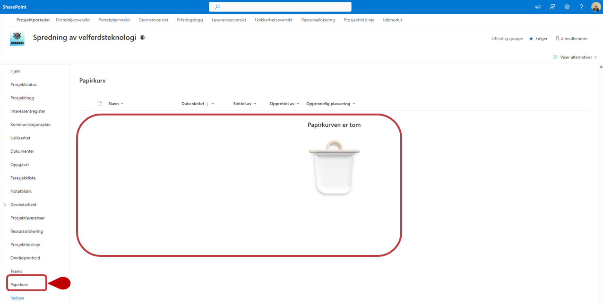

# Øvrige valg i menyen

Nederst på venstre meny finner man:

- **Områdeinnhold**
- **Teams**
- **Papirkurv**
- **Rediger** 

Her under vil du finne mer informasjon om disse menyepunktene.

## Områdeinnhold

Her finner du alle lister og bibliotek som er tilgjengelige i prosjektet. 
Du kan lære mer om Områdeinnhold i [Microsoft sine egne supportsider](https://support.microsoft.com/nb-no/office/sharepoint-omr%C3%A5deinnholdssiden-ba495c1e-00f4-475d-97c7-b518d546566b)

##  Teams  

1. I alle nye prosjekter vil du se en Teams-kobling helt nederst i venstre hjørne av menyen. Med denne koblingen kan du opprette et
team som vil være tilgjengelig i Microsoft Teams-appen.
2. Slik ser venstremeny ut før opprettelse av Teams.

     
3. Etter at teamet er opprettet vil denne koblingen skjules og erstattes med menyvalget **Teams**, som legger seg inn mellom **områdeinnhold** og **Papirkurv**. Med dette menyvalget vil du kunne gå rett over i Microsoft Teams hvor du kan fortsette å arbeide mot prosjektet.

## Papirkurv  
Her finner du alt du har slettet fra prosjektområdet, og kan
gjenopprette elementer om du har slettet noe ved uhell. Områdeeier kan se alt som er slettet, og kan gjenopprette uavhengig om det ble slettet av noen andre. Du kan lære mer om papirkurven i [Microsoft sine egne supportsider](https://support.office.com/nb-no/article/Behandle-papirkurven-for-et-SharePoint-omr%C3%A5de-8A6C2198-910E-42DC-9A9C-BC5BC4F327DA ).

##  Rediger venstremeny
Det er mulig å redigere venstre meny. Du kan lære hvordan i Microsoft sine egne supportsider - bla ned til ["Legge en kobling i navigasjonsmenyen på et gruppeområde"](https://support.microsoft.com/nb-no/office/tilpasse-navigasjonen-p%C3%A5-sharepoint-omr%C3%A5det-3cd61ae7-a9ed-4e1e-bf6d-4655f0bf25ca)

